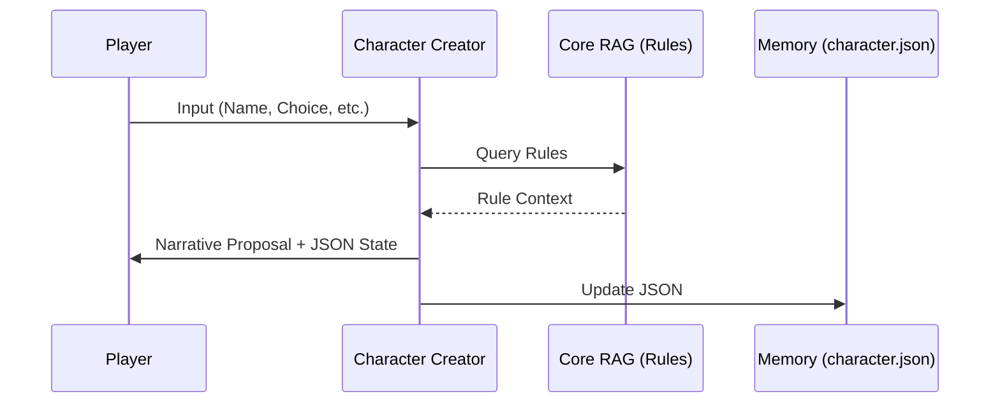
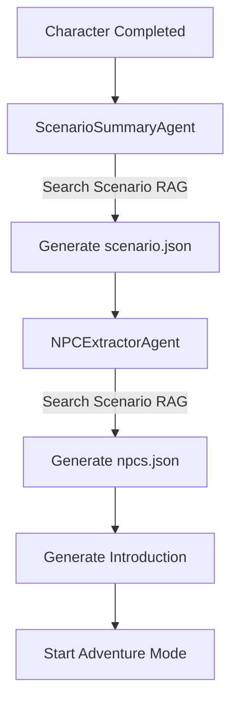
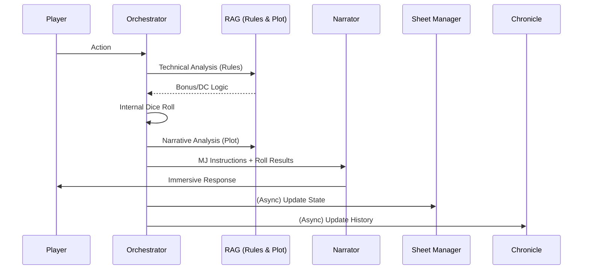

# 🎲 RPG Oracle - Multi-Agent RAG System

RPG Oracle is an advanced Tabletop Role-Playing Game (TTRPG) assistant that uses a multi-agent architecture and Retrieval-Augmented Generation (RAG) to provide a complete, autonomous gaming experience. It handles everything from character creation to complex narrative orchestration.

---

## 🏗 Architecture & Agents

The system is powered by several specialized agents, each with its own prompt, model configuration, and specific responsibilities.

### 1. The Orchestrator (`RPGAgent`)
*   **Role**: The "Brain" of the system. It handles high-level logic, state transitions (Creation → Summary → Adventure), and technical rules analysis.
*   **Key Functions**:
    *   Determines when a dice roll is needed based on the rules.
    *   Calculates bonuses using character data and RAG context.
    *   Coordinates other agents by providing precise MJ instructions.
*   **Context**: Accesses both `core_collection` (rules) and `scenario_collection` (plot).

### 2. Character Creator (`CharacterCreator`)
*   **Role**: Guides the player through a step-by-step character building process.
*   **Key Functions**:
    *   Proposes races, classes, and equipment based on the Codex.
    *   Calculates derived stats (HP, AC, Saves).
    *   Generates a persistent JSON character sheet.
*   **Context**: Strictly uses `core_collection` for rule compliance.

### 3. The Narrator (`Narrator`)
*   **Role**: The "Voice" of the Game Master. It transforms technical decisions into immersive storytelling.
*   **Key Functions**:
    *   Strict 5-part response structure: Immediate Perception, Environment Details, Narrative Tension, Action Hook, and Information Summary.
    *   Always writes in the second person ("You").
    *   Strictly prohibited from deciding rules or interpreting player intent.

### 4. Sheet Manager (`SheetManagerAgent`)
*   **Role**: Maintains the character's state in real-time.
*   **Key Functions**:
    *   Updates HP, inventory, and experience based on narrative events.
    *   Ensures character sheet updates follow the game's mechanics.
*   **Context**: Uses `core_collection` to validate mechanical changes.

### 5. Chronicle Agent (`ChronicleAgent`)
*   **Role**: The historian. It maintains a factual, concise summary of the adventure.
*   **Key Functions**:
    *   Updates `Memory/Chronicle.json` after every turn.
    *   Provides long-term memory for consistent storytelling over long sessions.

### 6. Setup Agents (One-shot)
*   **Scenario Summary Agent**: Extracts the title, pitch, and initial situation from the scenario RAG.
*   **NPC Extractor Agent**: Identifies named NPCs, extracts their profiles, goals, and "secrets" (visible only to the Orchestrator).

---

## 🔄 Data Flows

### Character Creation Flow


### Adventure Initialization


### Core Gameplay Loop


---

## 📚 RAG & Indexing

The project uses a dual-path RAG system to separate general rules from specific adventure plots.

### Directory Structure
*   `data/core/`: Place PDFs containing general game rules, world settings, and bestiaries here.
*   `data/scenario/`: Place PDFs containing the specific adventure module or campaign plot here.

### Using the Indexer
The `indexer.py` script processes these PDFs into a ChromaDB vector store.
```bash
# Basic indexing
python indexer.py

# Clear existing database and re-index
python indexer.py --clear
```
*Note: The system supports bilingual RAG. Queries are generated in both French and English to ensure maximum retrieval accuracy from diverse source materials.*

---

## ⚙️ Configuration (.env)

The system is highly configurable via the `.env` file. You can assign different models and temperatures to each agent.

| Variable | Description |
| :--- | :--- |
| `LLM_PROVIDER` | `ollama` or `openai` (compatible with llama-cpp) |
| `LLM_MODEL` | Default fallback model |
| `CHARACTER_MODEL` | Model specialized in rule-heavy character creation |
| `NARRATOR_MODEL` | Model specialized in creative writing |
| `ORCHESTRATOR_MODEL` | High-reasoning model for MJ logic |
| `RAG_SEARCH_K` | Number of document chunks to retrieve (default: 12) |
| `SERVER_PORT` | Streamlit port (default: 8501) |

---

## 🚀 Getting Started

### Prerequisites
*   **Python 3.9 to 3.13**: (Python 3.14+ is currently incompatible with ChromaDB/Pydantic V1).
*   An LLM Backend (Ollama or an OpenAI-compatible API).

### Installation
1.  Install dependencies:
    ```bash
    pip install -r requirements.txt
    ```
2.  Configure your environment:
    ```bash
    cp .env.example .env
    # Edit .env with your model names and URLs
    ```
3.  Index your data:
    ```bash
    python indexer.py
    ```
4.  Run the application:
    ```bash
    python run.py
    ```

---

## 💾 Session Management
The system automatically saves game state in the `Memory/` directory:
*   `character.json`: Current character sheet.
*   `scenario.json`: Adventure metadata.
*   `npcs.json`: Profiles of all encountered/relevant NPCs.
*   `Chronicle.json`: Running story summary.

At startup, the UI will detect these files and offer to **Resume** your adventure or **Start New**.
