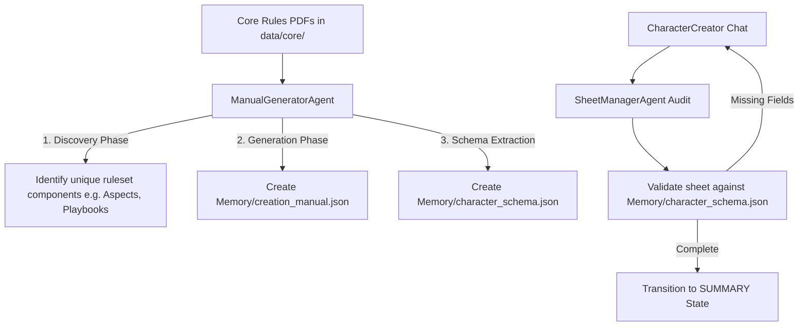
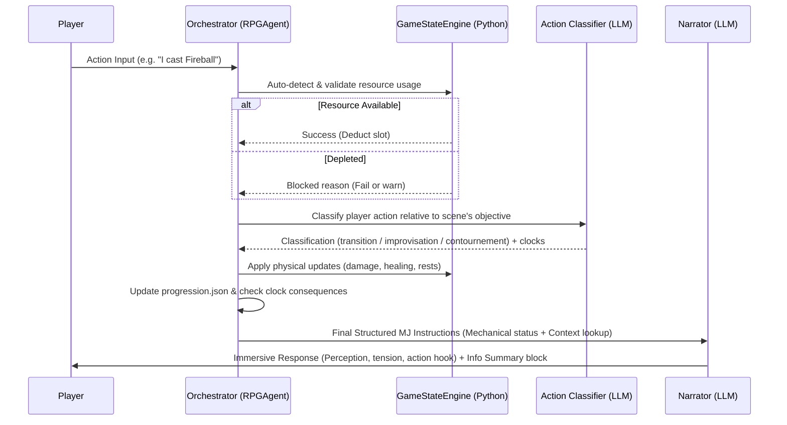

# 🎲 RPG Oracle - Multi-Agent RAG System

RPG Oracle is an advanced, ruleset-agnostic Tabletop Role-Playing Game (TTRPG) assistant. Powered by a multi-agent architecture and Retrieval-Augmented Generation (RAG), it orchestrates everything from dynamic character creation to complex narrative management, deterministic state progression tracking, and pure mechanical enforcement.

---

## 🏗 Architecture & Agents

The system uses specialized agents, each with dedicated prompts, LLM configurations, and clear responsibilities to split creative storytelling from rigorous rules enforcement.

### 1. The Orchestrator (`RPGAgent`)
*   **Role**: The "Brain" of the system. It handles state transitions (`CREATION` → `SUMMARY` → `ADVENTURE`), triggers technical rules analysis, and coordinates all sub-agents.
*   **Key Functions**:
    *   Determines when a roll or action is needed based on rules.
    *   Runs a pre-narrative **3-branch Player Action Classifier** (transition, improvisation, or contournement/bypass) in `ADVENTURE` mode to deterministically update active scenes/acts.
    *   Integrates the `GameStateEngine` to validate actions and apply consequences (damage, healing, XP, clock progress) before instructing the Narrator.
    *   Uses a factorized narrative builder to instruct the Narrator on exactly what facts to describe and what mechanical parameters are active.

### 2. Character Creator (`CharacterCreator`)
*   **Role**: Guides the player step-by-step through the ruleset-specific character building process.
*   **Key Functions**:
    *   Operates purely in narrative mode (does not output technical JSON directly) to maintain an immersive experience.
    *   Prepend the previous Master response to the user's input to enrich RAG queries and prevent conversational drift.
    *   Acts in tandem with the Sheet Manager to decouple raw chat interaction from structured technical data extraction.

### 3. The Narrator (`Narrator`)
*   **Role**: The "Voice" of the Game Master. Translates dry technical state changes into rich, atmospheric storytelling.
*   **Key Functions**:
    *   Enforces a strict narrative prompt: writes in the second person ("You"), never uses bullet points or numbering in its storytelling, and never decides rules or interprets player intent.
    *   Concludes every turn with a strict text block: `--- \n 📌 Résumé des informations`, which must report only facts explicitly stated in the narrative block.

### 4. Sheet Manager (`SheetManagerAgent`)
*   **Role**: Audits and maintains the character sheet in real-time.
*   **Key Functions**:
    *   Decoupled from the direct narrative flow of character creation. When end-phrases or state changes are detected, it runs an `audit_and_complete` pass on the conversational history to extract missing fields.
    *   Updates experience points, items, and inventory based on storyline event transitions.

### 5. Chronicle Agent (`ChronicleAgent`)
*   **Role**: The historian. Maintains a factual, concise chronicle of the adventure.
*   **Key Functions**:
    *   Updates `Memory/Chronicle.json` after every player action.
    *   Records clock consequences, major milestones, and `ecart_notable` (notable game-state deviations) as part of the persistent log.

### 6. Manual Generator (`ManualGeneratorAgent`)
*   **Role**: Ruleset extraction pipeline (one-shot).
*   **Key Functions**:
    *   Dynamically scans the Core vector store using rule-agnostic queries (e.g. searching for descriptors, playbooks, aspects, attributes instead of assuming generic D&D classes/races).
    *   Generates a structural creation handbook (`Memory/creation_manual.json`) and a rules-specific schema (`Memory/character_schema.json`) to validate completed character sheets.

### 7. Setup Agent (`ScenarioExtractorAgent`)
*   **Role**: Unified scenario compiler.
*   **Key Functions**:
    *   Processes PDF adventure modules via a 5-pass sequential extraction (Entities, Scene Nodes, Macro-structure, Global Clocks, and Metadata).
    *   Generates the deterministic reference file `Memory/scenario_structure.json`.

### 8. Scene Graph Agent (`SceneGraphAgent`)
*   **Role**: Scene mapper.
*   **Key Functions**:
    *   Extracts logical scene nodes and formats scene links, logical outputs, objectives, and anticipated NPC reactions into `Memory/scenes.json`.

---

## ⚡ Agnostic Character Creation System

Traditional TTRPG digital assistants are hardcoded to specific systems (like D&D 5e). RPG Oracle is **entirely ruleset-agnostic**, using a dual-stage extraction and dynamic validation pipeline.



1.  **Component Discovery**: `ManualGeneratorAgent` uses a specialized discovery prompt to scan raw rules documents. It detects the exact terminology used by the ruleset (whether it uses D&D-style Classes/Races, Numenera-style Type/Descriptor/Focus, or Powered by the Apocalypse Playbooks) and bypasses hardcoded templates.
2.  **Dynamic Handbooks & Schemas**: It compiles these rules into:
    *   `Memory/creation_manual.json`: The technical steps and limits (e.g., "Choose 3 skills", "Distribute 15 points") used to guide the player.
    *   `Memory/character_schema.json`: A dynamically compiled JSON schema defining the fields (and nested properties) required for a complete character sheet in this ruleset.
3.  **Two-Step Decoupled Creation**:
    *   The `CharacterCreator` guides the player narratively without halting to produce complex JSON blocks.
    *   When the player finishes, the `SheetManagerAgent` executes an `audit_and_complete` call, reviewing the whole chat transcript to extract stats, items, and attributes.
4.  **Schema-Based Validation**: The Orchestrator calls `validate_character_sheet()`, checking the extracted sheet against the ruleset's dynamic `character_schema.json`. If missing fields are found, the creator prompts the player for them; otherwise, the state transitions cleanly to `SUMMARY`.

---

## ⚙️ Game State Engine (Pure Python / Zero LLM)

To guarantee mechanical integrity and prevent LLM hallucinations, RPG Oracle separates narration from mathematics. The `GameStateEngine` (`game_state_engine.py`) is a pure-Python, zero-LLM engine that acts as the absolute source of truth for stats and resources.

### Key Capabilities
*   **Resource Tracking**: Manages HP, XP, generic consumable pools (e.g., Rage, Inspiration), and structured spell slots (e.g., `niveau_1` to `niveau_9`).
*   **Automatic Action Detection**: Analyzes player input for mechanical keywords (e.g., "cast", "rage", "rest") to flag action consumption or trigger restoration before generating responses.
*   **Derived Stat Recalculation**: The `synchronize_and_recalculate()` method handles stat dependencies (e.g., normalizing legacy HP fields, converting base attributes to modifiers, and capping current pools at maximums).
*   **Resting Mechanics**: Handles standard resting states:
    *   `long`: Complete restoration of all HP, spell slots, and generic daily resource pools.
    *   `short`: Partial restoration (e.g., healing 25% of max HP, recovering short-rest capabilities).
*   **Orchestrator Coordination**: Receives deterministic action triggers directly from the Orchestrator (e.g., `apply_damage(amount)`, `add_xp(amount)`) to ensure the state is persisted to `Memory/character.json` before any storytelling occurs.

---

## 📂 Scenario Reference & State Models

RPG Oracle manages adventure progression deterministically, keeping static plot structures separated from the active session state.

### 1. `Memory/scenario_structure.json`
Acts as the static scenario blueprint. No RAG is performed on this file.
```json
{
  "metadata": {
    "titre": "Nom du scénario",
    "pitch_global": "Résumé de l'intrigue en 2 sentences.",
    "scene_initiale": "SCENE_01_DEPART"
  },
  "macro_structure": [
    {
      "id_acte": "ACTE_1",
      "titre": "Titre",
      "condition_entree": "...",
      "condition_validation": "...",
      "scenes_incluses": ["SCENE_01_DEPART"]
    }
  ],
  "horloges_globales": [
    {
      "nom": "Nom de la menace",
      "declencheur": "Chasse ou temps",
      "consequence": "Le donjon s'effondre",
      "seuil": 6
    }
  ],
  "entites": {
    "pnj": [
      {
        "id": "PNJ_ELROND",
        "nom_complet": "Maître Elrond",
        "localisation_habituelle": "LIEU_FONDCOMBE",
        "agenda_et_motivation": "Aider les PJ",
        "peurs_et_faiblesses": "La perte de l'anneau",
        "attitude_initiale": "Bienveillant",
        "stats_et_capacites": "Inconnu"
      }
    ],
    "lieux": [
      {
        "id": "LIEU_FONDCOMBE",
        "nom_complet": "Fondcombe",
        "ambiance_sensorielle": "Chant de cascades et vent doux",
        "elements_interactifs": "Lore Books"
      }
    ]
  },
  "noeuds_sceniques": [
    {
      "id_scene": "SCENE_01_DEPART",
      "acte_rattache_id": "ACTE_1",
      "lieu_rattache_id": "LIEU_FONDCOMBE",
      "titre": "Rencontre",
      "pnj_presents": ["PNJ_ELROND"],
      "objectif_mj": "Expliquer le but",
      "condition_resolution": "Le PJ accepte la quête",
      "limites_et_regles_locales": "...",
      "defis_et_rencontres": [],
      "sorties_logiques": [
        {
          "action_ou_direction": "S'engager dans la forêt",
          "destination_scene_id": "SCENE_02_FORET"
        }
      ]
    }
  ]
}
```

### 2. `Memory/progression.json`
Tracks the active progression state of the running adventure session.
```json
{
  "acte_courant": "ACTE_1",
  "scene_courante": "SCENE_01_DEPART",
  "scenes_resolues": [],
  "scenes_contournees": [],
  "horloges": {
    "Nom de la menace": {
      "segments": 0,
      "declenchee": false
    }
  },
  "ecarts_notables": []
}
```

---

## 🛠️ Scenario Loading & Self-Healing Pipeline

During world setup (`setup_world()`), the system ensures scenario files are clean, valid, and highly optimized:

### 1. Source Detection
The orchestrator scans `data/scenario/` for resources:
*   **Single JSON File**: Directly loads and validations the file as the blueprint.
*   **Multiple JSON Files**: Raises a `ValueError` to prevent session collisions.
*   **No JSON Files (PDFs only)**: Begins the 5-pass extraction using `ScenarioExtractorAgent`.

### 2. Static Validation & Self-Healing
Every loaded scenario runs through a strict validation suite in `validation.py` before execution starts:
*   **Orphan Cleanups**: Replaces invalid PNJ, scene, or place references with `null` or removes them with warning logs.
*   **Bidirectional Act-Scene Alignment**: Auto-synchronizes scenes pointing to acts and acts listing scenes, correcting missing cross-references dynamically.
*   **Duplicate ID Detection**: Detects duplicated entity or scene IDs across collections to prevent silent state overrides.
*   **Seuil Defaulting**: Missing global clock thresholds auto-heal to a default of `6`.
*   **Blocking Validation**: If critical fields (like `condition_resolution` or `acte_rattache_id`) are missing, the validator halts initialization and flags a manual fix or re-extraction.

### 3. Full-Text Bypass Optimization
Standard RAG similarity searches can fail to resolve context for shorter modules. If a scenario's concatenated text length is under `SCENARIO_FULLTEXT_THRESHOLD_CHARS` (default: `40000`), the extractor **bypasses semantic search completely**, feeding the complete raw text directly to all extraction passes to guarantee absolute structural context.

---

## 🔄 Core Gameplay Loop (Adventure Mode)



---

## 📚 RAG & Indexing

RPG Oracle runs a bilingual dual-path vector store system to split system rules from story plots.

### Directory Structure
*   `data/core/`: Place PDFs containing system mechanics, world setting guidelines, and bestiaries.
*   `data/scenario/`: Place PDFs containing adventure structures, scenario books, or campaign logs.

### Using the Indexer
Run the custom CLI script `indexer.py` to index rules, compile character handbooks, and reset databases:
```bash
# Basic indexing of core and scenario folders
python indexer.py

# Wipe Chroma DB, clear Memory/, re-index rules, and generate manuals
python indexer.py --reset

# Index rules only
python indexer.py --core

# Index scenario documents only
python indexer.py --scenario

# Re-run character handbook generation only
python indexer.py --pj
```

---

## ⚙️ Configuration (.env)

Adjust settings and models individually per agent:

| Variable | Description |
| :--- | :--- |
| `LLM_PROVIDER` | `ollama` or `openai` (or any compatible OpenAI endpoints) |
| `LLM_MODEL` | Default fallback model name |
| `CHARACTER_MODEL` | Specialized rules model for character creation |
| `NARRATOR_MODEL` | Creative model for immersive narrative prose |
| `ORCHESTRATOR_MODEL` | High-reasoning model for MJ state logic |
| `RAG_SEARCH_K` | Number of rules chunks to retrieve (default: 12) |
| `SCENARIO_FULLTEXT_THRESHOLD_CHARS` | Threshold under which the full scenario text is processed directly (default: 40000) |
| `CORE_FULLTEXT_THRESHOLD_CHARS` | Threshold under which the full core rules text is processed directly (default: 40000) |
| `SERVER_PORT` | Streamlit server port (default: 8501) |

---

## 🚀 Getting Started

### Prerequisites
*   **Python 3.9 to 3.13** (Note: Python 3.14+ is currently unsupported due to ChromaDB dependencies).
*   An LLM backend (Ollama, llama.cpp, or OpenAI compatible APIs).

### Installation
1.  Install pinned dependencies:
    ```bash
    python -m pip install -r requirements.txt
    ```
2.  Setup environment variables:
    ```bash
    cp .env.example .env
    # Edit .env to set your LLM providers and models
    ```
3.  Index system files:
    ```bash
    python indexer.py
    ```
4.  Run the application:
    ```bash
    python run.py
    ```

---

## 💾 Session Management & Save States
Session state is written to the `Memory/` directory:
*   `character.json`: Current active character sheet.
*   `scenario_structure.json`: Loaded static structural scenario reference.
*   `progression.json`: Active campaign progression, completed scenes, and horloges.
*   `Chronicle.json`: Running story and narrative timeline.

*   **Resetting Session**: Calling `clear_history()` resets the active session by deleting `character.json`, `Chronicle.json`, and `progression.json`, while **preserving** `scenario_structure.json` as a static reference blueprint.
