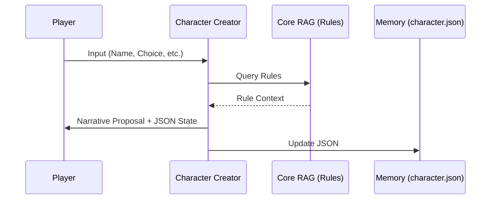
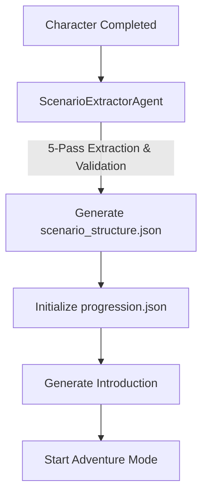
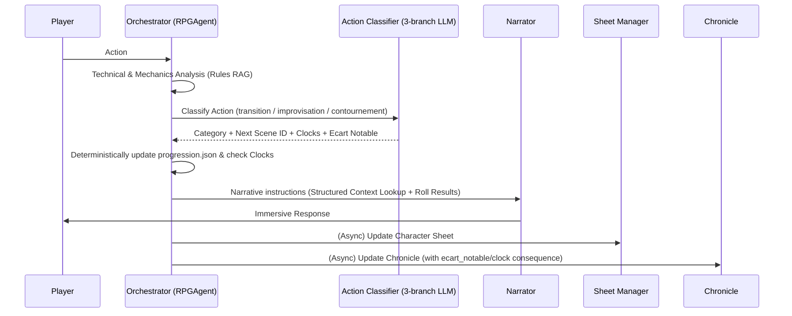

# 🎲 RPG Oracle - Multi-Agent RAG System

RPG Oracle is an advanced Tabletop Role-Playing Game (TTRPG) assistant that uses a multi-agent architecture and Retrieval-Augmented Generation (RAG) to provide a complete, autonomous gaming experience. It handles everything from character creation to complex narrative orchestration.

---

## 🏗 Architecture & Agents

The system is powered by several specialized agents, each with its own prompt, model configuration, and specific responsibilities.

### 1. The Orchestrator (`RPGAgent`)
*   **Role**: The "Brain" of the system. It handles high-level logic, state transitions (Creation → Summary → Adventure), and technical rules analysis.
*   **Key Functions**:
    *   Determines when a dice roll is needed based on the rules.
    *   Calculates bonuses using character data and RAG context.
    *   Coordinates other agents by providing precise MJ instructions.
    *   Performs **deterministic scene and act lookups** on the loaded `scenario_structure.json` and manages state transitions through a 3-branch player action classifier.
*   **Context**: Accesses the `core_collection` (rules) for game mechanics, and reads current narrative elements via direct structured lookups. Uses raw `scenario_collection` chunks purely for long-form dialogue and world descriptions.

### 2. Character Creator (`CharacterCreator`)
*   **Role**: Guides the player through a step-by-step character building process.
*   **Key Functions**:
    *   Proposes races, classes, and equipment based on the Codex.
    *   Calculates derived stats (HP, AC, Saves).
    *   Generates a persistent JSON character sheet.
*   **Context**: Strictly uses `core_collection` for rule compliance.

### 3. The Narrator (`Narrator`)
*   **Role**: The "Voice" of the Game Master. It transforms technical decisions into immersive storytelling.
*   **Key Functions**:
    *   Strict 5-part response structure: Immediate Perception, Environment Details, Narrative Tension, Action Hook, and Information Summary.
    *   Always writes in the second person ("You").
    *   Strictly prohibited from deciding rules or interpreting player intent.

### 4. Sheet Manager (`SheetManagerAgent`)
*   **Role**: Maintains the character's state in real-time.
*   **Key Functions**:
    *   Updates HP, inventory, and experience based on narrative events.
    *   Ensures character sheet updates follow the game's mechanics.
*   **Context**: Uses `core_collection` to validate mechanical changes.

### 5. Chronicle Agent (`ChronicleAgent`)
*   **Role**: The historian. It maintains a factual, concise summary of the adventure.
*   **Key Functions**:
    *   Updates `Memory/Chronicle.json` after every turn.
    *   Integrates `ecart_notable` (notable deviations / clock events) into the running chronicle of events.

### 6. Setup Agent (`ScenarioExtractorAgent`)
*   **Role**: Unified pipeline extractor (one-shot).
*   **Key Functions**:
    *   Performs a **5-pass extraction** from the adventure PDF to build the highly complete `Memory/scenario_structure.json` (Entities, Scene Nodes, Macro-structure, Global Clocks, and Metadata).
    *   Applies **cross-validation** to filter orphan references (removing invalid PNJ/scene/lieu references) and performs **bidirectional act-scene corrections**.

---

## 📂 Scenario Reference & State Models

Narrative progression is tracked **deterministically** through static reference and active state JSON files.

### 1. `Memory/scenario_structure.json`
Acts as the static scenario blueprint. No RAG is performed on this file.
```json
{
  "metadata": {
    "titre": "Nom du scénario",
    "pitch_global": "Résumé de l'intrigue en 2 sentences.",
    "scene_initiale": "SCENE_01_DEPART"
  },
  "macro_structure": [
    {
      "id_acte": "ACTE_1",
      "titre": "Titre",
      "condition_entree": "...",
      "condition_validation": "...",
      "scenes_incluses": ["SCENE_01_DEPART"]
    }
  ],
  "horloges_globales": [
    {
      "nom": "Nom de la menace",
      "declencheur": "Chasse ou temps",
      "consequence": "Le donjon s'effondre",
      "seuil": 6
    }
  ],
  "entites": {
    "pnj": [
      {
        "id": "PNJ_ELROND",
        "nom_complet": "Maître Elrond",
        "localisation_habituelle": "LIEU_FONDCOMBE",
        "agenda_et_motivation": "Aider les PJ",
        "peurs_et_faiblesses": "La perte de l'anneau",
        "attitude_initiale": "Bienveillant",
        "stats_et_capacites": "Inconnu"
      }
    ],
    "lieux": [
      {
        "id": "LIEU_FONDCOMBE",
        "nom_complet": "Fondcombe",
        "ambiance_sensorielle": "Chant de cascades et vent doux",
        "elements_interactifs": "Lore Books"
      }
    ]
  },
  "noeuds_sceniques": [
    {
      "id_scene": "SCENE_01_DEPART",
      "acte_rattache_id": "ACTE_1",
      "lieu_rattache_id": "LIEU_FONDCOMBE",
      "titre": "Rencontre",
      "pnj_presents": ["PNJ_ELROND"],
      "objectif_mj": "Expliquer le but",
      "condition_resolution": "Le PJ accepte la quête",
      "limites_et_regles_locales": "...",
      "defis_et_rencontres": [],
      "sorties_logiques": [
        {
          "action_ou_direction": "S'engager dans la forêt",
          "destination_scene_id": "SCENE_02_FORET"
        }
      ]
    }
  ]
}
```

### 2. `Memory/progression.json`
Tracks the active progression state of the running adventure session.
```json
{
  "acte_courant": "ACTE_1",
  "scene_courante": "SCENE_01_DEPART",
  "scenes_resolues": [],
  "scenes_contournees": [],
  "horloges": {
    "Nom de la menace": {
      "segments": 0,
      "declenchee": false
    }
  },
  "ecarts_notables": []
}
```

---

## 🔄 Data Flows

### Character Creation Flow


### Adventure Initialization


### Core Gameplay Loop (Adventure Mode)


---

## 📚 RAG & Indexing

The project uses a dual-path RAG system to separate general rules from specific adventure plots.

### Directory Structure
*   `data/core/`: Place PDFs containing general game rules, world settings, and bestiaries here.
*   `data/scenario/`: Place PDFs containing the specific adventure module or campaign plot here.

### Using the Indexer
The `indexer.py` script processes these PDFs into a ChromaDB vector store.
```bash
# Basic indexing
python indexer.py

# Clear existing database and re-index
python indexer.py --clear
```
*Note: The system supports bilingual RAG. Queries are generated in both French and English to ensure maximum retrieval accuracy from diverse source materials.*

---

## ⚙️ Configuration (.env)

The system is highly configurable via the `.env` file. You can assign different models and temperatures to each agent.

| Variable | Description |
| :--- | :--- |
| `LLM_PROVIDER` | `ollama` or `openai` (compatible with llama-cpp) |
| `LLM_MODEL` | Default fallback model |
| `CHARACTER_MODEL` | Model specialized in rule-heavy character creation |
| `NARRATOR_MODEL` | Model specialized in creative writing |
| `ORCHESTRATOR_MODEL` | High-reasoning model for MJ logic |
| `RAG_SEARCH_K` | Number of document chunks to retrieve (default: 12) |
| `SERVER_PORT` | Streamlit port (default: 8501) |

---

## 🚀 Getting Started

### Prerequisites
*   **Python 3.9 to 3.13**: (Python 3.14+ is currently incompatible with ChromaDB/Pydantic V1).
*   An LLM Backend (Ollama or an OpenAI-compatible API).

### Installation
1.  Install dependencies:
    ```bash
    python -m pip install -r requirements.txt
    ```
2.  Configure your environment:
    ```bash
    cp .env.example .env
    # Edit .env with your model names and URLs
    ```
3.  Index your data:
    ```bash
    python indexer.py
    ```
4.  Run the application:
    ```bash
    python run.py
    ```

---

## 💾 Session Management & State Deletion
The system automatically saves game state in the `Memory/` directory:
*   `character.json`: Current character sheet.
*   `scenario_structure.json`: Loaded static structural blueprint.
*   `progression.json`: Running story and scenario state.
*   `Chronicle.json`: Running narrative summary.

*   **Resetting Session**: Calling `clear_history()` resets the active session by deleting `character.json`, `Chronicle.json`, and `progression.json`, while **preserving** `scenario_structure.json` as a static blueprint.
